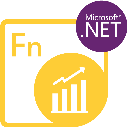

{}

<h2>Welcome to Aspose.Finance for .NET</h2>

Aspose.Finance, as a pure .NET library provides much better performance and ease of use to manipulate finance-related formats, such as XBRL, iXBRL, OFX. The finance API is extensible, easy to use and compact and provides all common functionality so developers write less code to do common operations.

{}

<h3>Aspose.Finance for .NET Resources</h3>

The following are the links to some useful resources you may need to accomplish your tasks.

- [Aspose.Finance for .NET Online Documentation](/finance/net/)
- [Aspose.Finance for .NET Release Notes](https://releases.aspose.com/finance/net/release-notes/)
- [Aspose.Finance for .NET Product Page](https://products.aspose.com/finance/net)
- [Install Aspose.Finance for .NET](/finance/net/installation/)
- [Aspose.Finance for .NET API Reference Guide](https://reference.aspose.com/finance/net)
- [Aspose.Finance for .NET Free Support Forum](https://forum.aspose.com/c/finance)
- [Aspose.Finance for .NET Paid Support Helpdesk](https://helpdesk.aspose.com/)

{}

<h2>Welcome to Aspose.Finance for Python via .NET</h2>

Aspose.Finance for Python via .NET, as a Python library provides much better performance and ease of use to manipulate finance-related formats, such as XBRL, iXBRL, OFX. The finance API is extensible, easy to use and compact and provides all common functionality so developers write less code to do common operations.

{}

<h3>Aspose.Finance for Python via .NET Resources</h3>

The following are the links to some useful resources you may need to accomplish your tasks.

- [Aspose.Finance for Python via .NET Online Documentation](/finance/python-net/)
- [Aspose.Finance for Python via .NET Release Notes](https://releases.aspose.com/finance/python-net/release-notes/)
- [Aspose.Finance for Python via .NET Product Page](https://products.aspose.com/finance/python-net)
- [Install Aspose.Finance for Python via .NET](/finance/python-net/installation/)
- [Aspose.Finance for Python via .NET Free Support Forum](https://forum.aspose.com/c/finance)
- [Aspose.Finance for Python via .NET Paid Support Helpdesk](https://helpdesk.aspose.com/)
