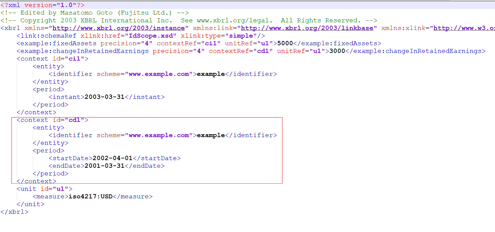
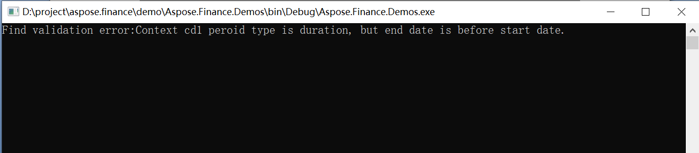
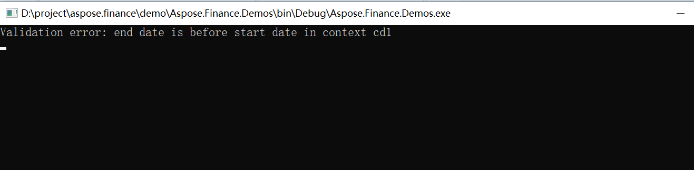

## **Validate XBRL instance file in C#**
XBRL Instances, XBRL Linkbases, and XBRL Taxonomy Schemas MUST comply with the syntax requirements imposed in [XBRL specification](http://www.xbrl.org/Specification/XBRL-2.1/REC-2003-12-31/XBRL-2.1-REC-2003-12-31+corrected-errata-2013-02-20.html). To validate these, the [XbrlInstance](https://reference.aspose.com/finance/net/aspose.finance.xbrl/xbrlinstance) class provides the [Validate()](https://reference.aspose.com/finance/net/aspose.finance.xbrl/xbrlinstance/methods/validate) method.

The following C# code snippet demonstrates how to validate an XBRL instance document.


## **Validate iXBRL file in C#**
The [iXBRL specification](http://www.xbrl.org/specification/inlinexbrl-part1/rec-2013-11-18/inlinexbrl-part1-rec-2013-11-18.html) defines many validation rules. For validating iXBRL files, the [InlineXbrlDocument](https://reference.aspose.com/finance/net/aspose.finance.xbrl.inline/inlinexbrldocument) class provides a [Validate()](https://reference.aspose.com/finance/net/aspose.finance.xbrl.inline/inlinexbrldocument/methods/validate) method.

The following C# code snippet demonstrates validating an iXBRL instance document.


## **Validation error codes**
In the enum [ValidationErrorCode](https://reference.aspose.com/finance/net/aspose.finance.xbrl.validator/validationerrorcode), validation error codes are defined for each validation rule. 
The following are the error code definitions:

- ContextPeriodNoStartTime: Context period type is duration, but has no start date.
- ContextPeriodNoEndTime: Context period type is duration, but has no end date.
- ContextPeriodStartAfterEnd: Context period type is duration, but the end date is before the start date.
- ContextInstantNoTime: Context period type is instant, but has no instant date.
- ContextScenarioXbrlNamespace: Context scenario can not have XBRL namespace node.
- ContextScenarioXbrlSubstitutionGroup: Context scenario can not have an element in the substitution group for elements defined in the XBRL namespace.
- ContextScenarioEmpty: Context scenario can not be empty.
- ContextSegmentXbrlNamespace: Context segment can not have XBRL namespace node.
- ContextSegmentXbrlSubstitutionGroup: Context segment can not have element in the substitution group for elements defined in the XBRL namespace.
- ContextSegmentEmpty: Context segment can not be empty.
- ItemNoContext: Item must have a context.
- ItemPeroidTypeConflictWithContext: Item has period type conflict with context.
- ItemNumericNoUnit: Item is numeric and must have a unit.
- MonetaryItemNoSingleUnitMeasure: Item is a monetary type and must have a single unit measure.
- MonetaryItemNoISO4217: Item is a monetary type and must have an Iso 4217 style unit measure.
- ShareItemNoSingleUnitMeasure: Item is a share type and must have a single unit measure.
- ShareItemNoShareUnitMeasure:  Item is share type and must have an xbrli:shares unit measure.
- NillItemWithPrecisionOrDecimals: Item is nil and must not have either precision or decimals.
- FractionItemWithPrecisionOrDecimals: Item is a fraction type and must not have either precision or decimals.
- NumericItemWithBothPrecisionAndDecimals: Item is a numeric type and must not have both precision and decimals.
- NumericItemWithoutPrecisionOrDecimals: Item is a numeric type and must have either precision or decimals.
- NonNumericItemWithPrecisionOrDecimals: Item is not a numeric type and must not have either precision or decimals.
- FootnoteArcFromNotFound: Unable to find Footnote arc from Loc.
- FootnoteArcToNotFound: Unable to find Footnote arc to Footnote.
- DefinitionArcFromNotFound: Unable to find Definition arc from Loc.
- DefinitionArcToNotFound: Unable to find Definition arc to Loc.
- EssenceAliasDefinitionArcDifferentType: Essence-alias Definition arc has different types.
- EssenceAliasDefinitionArcDifferentPeriodType: Essence-alias Definition arc has different periodTypes.
- EssenceAliasDefinitionArcDifferentBalance: Essence-alias Definition arc has different balances.
- CalculationArcFromNotFound: Unable to find Calculation arc from Loc.
- CalculationArcToNotFound: Unable to find Calculation arc to Loc.
- LabelArcFromNotFound: Unable to find Lable arc from Loc.
- LabelArcToNotFound: Unable to find Lable arc to Loc.
- PresentationArcFromNotFound: Unable to find a Presentation arc from Loc.
- PresentationArcToNotFound: Unable to find a Presentation arc to Loc.
- ReferenceArcFromNotFound: Unable to find a Reference arc from Loc.
- ReferenceArcToNotFound: Unable to find a Reference arc to Loc.
### **Example of standard validation error message**

Above is an XBRL instance, it defines context “cd1”, this context period type is duration, it’s start date is 2002-03-31, the end date is 2001-03-31, so the end date is before than start date. In XBRL specification, chapter 4.7.2, it defines validation rule: “the endDate MUST specify or imply a point in time that is later than the specified or implied point in time of the corresponding startDate”. According to this rule, this XBRL instance is not a valid one.
## **Validate XBRL and output standard error message**
The following code validates the XBRL instance and outputs the standard error message.



The following image shows the output:

## **Validate XBRL and output customized error message**
The following code validates the XBRL instance and output customized error message.



The following image shows the output:

**Validate XBRL and output standard error message**

