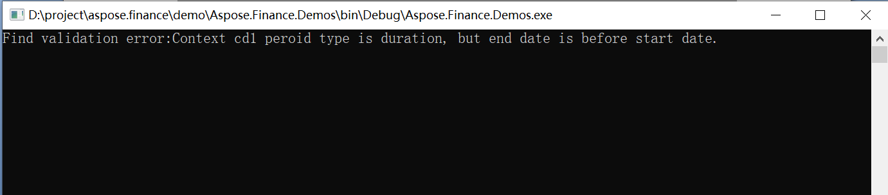

## **Validate XBRL instance file in Python**
XBRL Instances, XBRL Linkbases, and XBRL Taxonomy Schemas MUST comply with the syntax requirements imposed in [XBRL specification](http://www.xbrl.org/Specification/XBRL-2.1/REC-2003-12-31/XBRL-2.1-REC-2003-12-31+corrected-errata-2013-02-20.html). To validate these, the XbrlInstance class provides the validate() method.

The following Python code snippet demonstrates how to validate an XBRL instance document.


## **Validate iXBRL file in Python**
The [iXBRL specification](http://www.xbrl.org/specification/inlinexbrl-part1/rec-2013-11-18/inlinexbrl-part1-rec-2013-11-18.html) defines many validation rules. For validating iXBRL files, the InlineXbrlDocument class provides a validate() method.

The following Python code snippet demonstrates validating an iXBRL instance document.


## **Validation error codes**
In the enum ValidationErrorCode, validation error codes are defined for each validation rule. 
The following are the error code definitions:

- CONTEXT_PERIOD_NO_START_TIME: Context period type is duration, but has no start date.
- CONTEXT_PERIOD_NO_END_TIME: Context period type is duration, but has no end date.
- CONTEXT_PERIOD_START_AFTER_END: Context period type is duration, but the end date is before the start date.
- CONTEXT_INSTANT_NO_TIME: Context period type is instant, but has no instant date.
- CONTEXT_SCENARIO_XBRL_NAMESPACE: Context scenario can not have XBRL namespace node.
- CONTEXT_SCENARIO_XBRL_SUBSTITUTION_GROUP: Context scenario can not have an element in the substitution group for elements defined in the XBRL namespace.
- CONTEXT_SCENARIO_EMPTY: Context scenario can not be empty.
- CONTEXT_SEGMENT_XBRL_NAMESPACE: Context segment can not have XBRL namespace node.
- CONTEXT_SEGMENT_XBRL_SUBSTITUTIONGROUP: Context segment can not have element in the substitution group for elements defined in the XBRL namespace.
- CONTEXT_SEGMENT_EMPTY: Context segment can not be empty.
- ITEM_NO_CONTEXT: Item must have a context.
- ITEM_PEROID_TYPE_CONFLICT_WITH_CONTEXT: Item has period type conflict with context.
- ITEM_NUMERIC_NO_UNIT: Item is numeric and must have a unit.
- MONETARY_ITEM_NO_SINGLE_UNIT_MEASURE: Item is a monetary type and must have a single unit measure.
- MONETARY_ITEM_NO_ISO4217: Item is a monetary type and must have an Iso 4217 style unit measure.
- SHARE_ITEM_NO_SINGLE_UNIT_MEASURE: Item is a share type and must have a single unit measure.
- SHARE_ITEM_NO_SHARE_UNIT_MEASURE:  Item is share type and must have an xbrli:shares unit measure.
- NILL_ITEM_WITH_PRECISION_OR_DECIMALS: Item is nil and must not have either precision or decimals.
- FRACTION_ITEM_WITH_PRECISION_OR_DECIMALS: Item is a fraction type and must not have either precision or decimals.
- NUMERIC_ITEM_WITH_BOTH_PRECISION_AND_DECIMALS: Item is a numeric type and must not have both precision and decimals.
- NUMERIC_ITEM_WITHOUT_PRECISION_OR_DECIMALS: Item is a numeric type and must have either precision or decimals.
- NON_NUMERIC_ITEM_WITH_PRECISION_OR_DECIMALS: Item is not a numeric type and must not have either precision or decimals.
- FOOTNOTE_ARC_FROM_NOT_FOUND: Unable to find Footnote arc from Loc.
- FOOTNOTE_ARC_TO_NOT_FOUND: Unable to find Footnote arc to Footnote.
- DEFINITION_ARC_FROM_NOT_FOUND: Unable to find Definition arc from Loc.
- DEFINITION_ARC_TO_NOT_FOUND: Unable to find Definition arc to Loc.
- ESSENCE_ALIAS_DEFINITION_ARC_DIFFERENT_TYPE: Essence-alias Definition arc has different types.
- ESSENCE_ALIAS_DEFINITION_ARC_DIFFERENT_PERIOD_TYPE: Essence-alias Definition arc has different periodTypes.
- ESSENCE_ALIAS_DEFINITION_ARC_DIFFERENT_BALANCE: Essence-alias Definition arc has different balances.
- CALCULATION_ARC_FROM_NOT_FOUND: Unable to find Calculation arc from Loc.
- CALCULATION_ARC_TO_NOT_FOUND: Unable to find Calculation arc to Loc.
- LABEL_ARC_FROM_NOT_FOUND: Unable to find Lable arc from Loc.
- LABEL_ARC_TO_NOT_FOUND: Unable to find Lable arc to Loc.
- PRESENTATION_ARC_FROM_NOT_FOUND: Unable to find a Presentation arc from Loc.
- PRESENTATION_ARC_TO_NOT_FOUND: Unable to find a Presentation arc to Loc.
- REFERENCE_ARC_FROM_NOT_FOUND: Unable to find a Reference arc from Loc.
- REFERENCE_ARC_TO_NOT_FOUND: Unable to find a Reference arc to Loc.
### **Example of standard validation error message**

Above is an XBRL instance, it defines context “cd1”, this context period type is duration, it’s start date is 2002-03-31, the end date is 2001-03-31, so the end date is before than start date. In XBRL specification, chapter 4.7.2, it defines validation rule: “the endDate MUST specify or imply a point in time that is later than the specified or implied point in time of the corresponding startDate”. According to this rule, this XBRL instance is not a valid one.
## **Validate XBRL and output standard error message**
The following code validates the XBRL instance and outputs the standard error message.



The following image shows the output:

